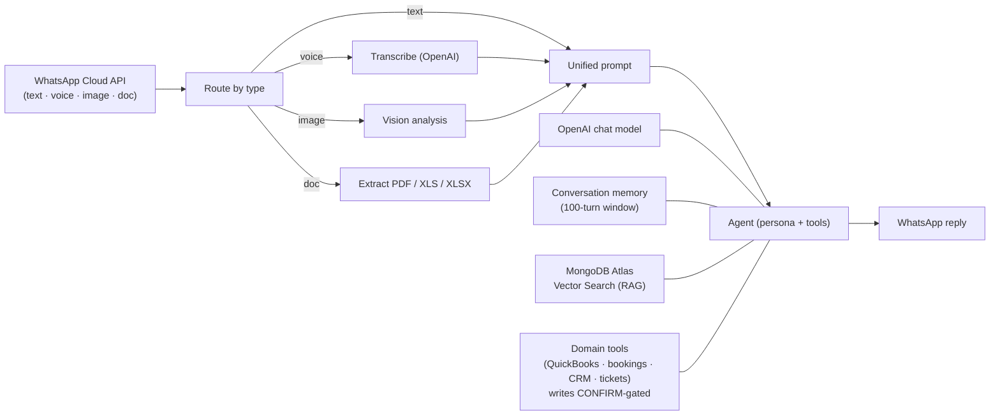

# Omniagent


**One agent. Every channel. Every job.**

Omniagent is an AI-agent product for real businesses. It deploys
agents that answer customers and run the back office over **WhatsApp** — understanding
**text, voice notes, images, PDFs and spreadsheets**, answering from the business's
**own knowledge** (RAG), remembering the conversation, and taking **real actions in
real tools** with **human approval on anything that moves money.**

> Built WhatsApp-first; the same agent core is channel-agnostic by design. The engine
> is a set of importable n8n workflows — a customer runs it on their own n8n, OpenAI
> key and MongoDB Atlas cluster.

---

## What's in this repo

| Path | What it is |
| --- | --- |
| `index.html` | The **Omniagent marketing & sales site** — self-contained, no build step. Open it in a browser or serve the folder. This is what a prospective business sees. |
| `omniagent-engine/` | The **agent engine** — importable [n8n](https://n8n.io) workflows that run the real product (multimodal RAG pipeline + memory + gated tool actions). See its [README](omniagent-engine/README.md). |
| `docs/` | Go-to-market collateral: the [sales one-pager](docs/SALES-ONEPAGER.md) and the [deployment runbook](docs/DEPLOYMENT.md). |
| `mcp-server/` | A **Model Context Protocol server** that lets an AI assistant inspect the agent catalog, personas, tools and docs in this repo. See [its README](mcp-server/README.md). |

## The agent catalog

Every agent shares the **identical multimodal front-end** (WhatsApp trigger → type
routing → voice/image/document handling → unified prompt → agent → reply). Only the
**persona and the tools** change — so a new agent is configuration, not a rebuild.

| Agent | Workflow | What it does |
| --- | --- | --- |
| **Concierge** | `omniagent-engine/workflow.json` | Always-on first responder — grounded answers over every format, clean escalation. |
| **Support Agent** | `omniagent-engine/workflow-customer-support.json` | Front-line support for any business + ticket/escalation tool. |
| **Bookkeeper Agent** | `omniagent-engine/workflow-quickbooks-specialist.json` | Live QuickBooks Online reads + **CONFIRM-gated** invoice/payment writes. |
| **Reservations Agent** | `omniagent-engine/workflow-reservations.json` | Real availability checks + **CONFIRM-gated** booking / reschedule / cancel. |
| **Sales Qualifier** | `omniagent-engine/workflow-sales-qualifier.json` | Greets & qualifies inbound leads, books demos, pushes scored leads to the CRM. |

The specialists are **generated** from the base workflow — edit
`omniagent-engine/workflow.json`, run `node build-variants.mjs`, and every agent
inherits the change.

## Architecture



Stack: **n8n + OpenAI + WhatsApp Cloud API + MongoDB Atlas Vector Search**. The
`ingest-knowledge-base.json` companion workflow loads a business's documents into the
vector store.

## Run the site locally

No build step — it's a single self-contained file (fonts from Google Fonts, nothing else).

```bash
python3 -m http.server 4600   # then open http://localhost:4600
```

`index.html` is what GitHub Pages serves (deployed automatically on every push to
`main` by `.github/workflows/pages.yml`).

## MCP server (AI-native repo)

The repo ships a stdio MCP server so an AI assistant can query it as structured data
instead of raw files:

| Tool | Answers |
| --- | --- |
| `list_agents` | "What agents exist, on which model, with which tools?" |
| `get_agent` | "What exactly is the Bookkeeper's persona and which writes are gated?" |
| `diff_agent_vs_base` | "How does a specialist differ from the base Concierge?" |
| `get_site_structure` | "What does the sales site actually say, section by section?" |
| `get_doc` / `search_repo` | Docs verbatim, and search across everything. |

```bash
cd mcp-server && npm install && cd ..
claude mcp add choreless -- node mcp-server/server.mjs
```

A root [`.mcp.json`](.mcp.json) registers it for clients that support project-scoped
MCP config. Details in [`mcp-server/README.md`](mcp-server/README.md).

## Why businesses buy it

- **Grounded, not guessing** — answers are retrieved from the customer's own documents
  and cited inline; if it's not in the knowledge base, the agent says so and escalates.
- **Human-gated actions** — anything irreversible is held behind a typed `CONFIRM`
  protocol baked into the agent's system prompt.
- **Their data, their tenancy** — runs on the customer's own n8n, OpenAI key and MongoDB
  Atlas cluster. No middleman, no training on their conversations.
- **Live in a weekend** — one importable workflow, ~20 minutes of credential wiring.

See [`docs/SALES-ONEPAGER.md`](docs/SALES-ONEPAGER.md) for the pitch and
[`docs/DEPLOYMENT.md`](docs/DEPLOYMENT.md) for the go-live runbook.

## Status & history

This is a **product demo / go-to-market prototype**: the workflows are real and
importable, but you bring your own n8n instance, WhatsApp Business number, OpenAI key
and MongoDB Atlas cluster — the deployment runbook walks through all of it. The
repository is named `choreless` because it previously hosted the Choreless
chore-outsourcing concept; it was repurposed for Omniagent in July 2026 (the history
is in the git log).

## License

[MIT](LICENSE) © 2026 GreenAI Solutions.
